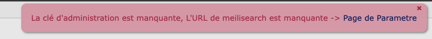
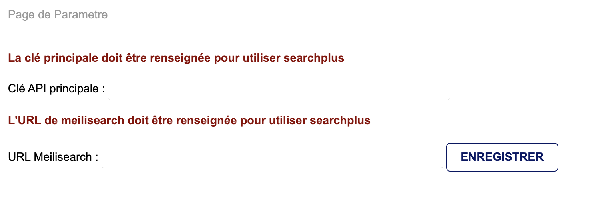
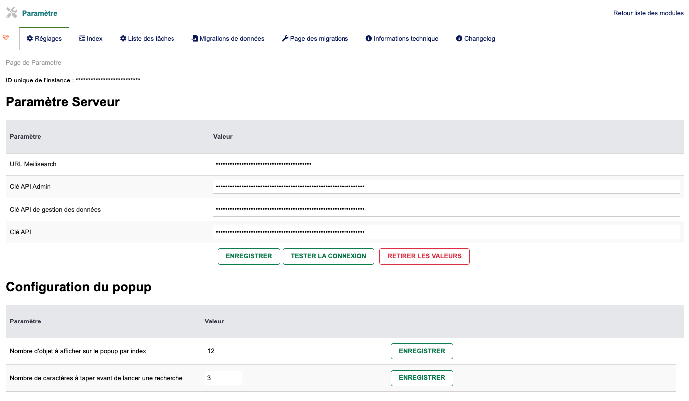
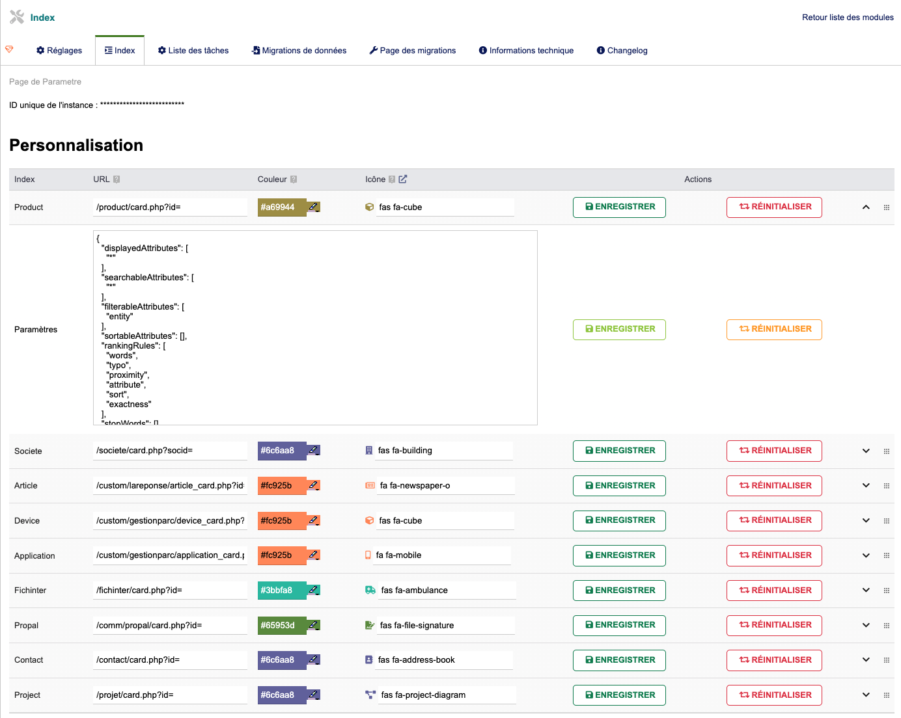
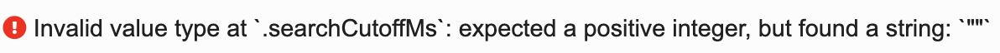
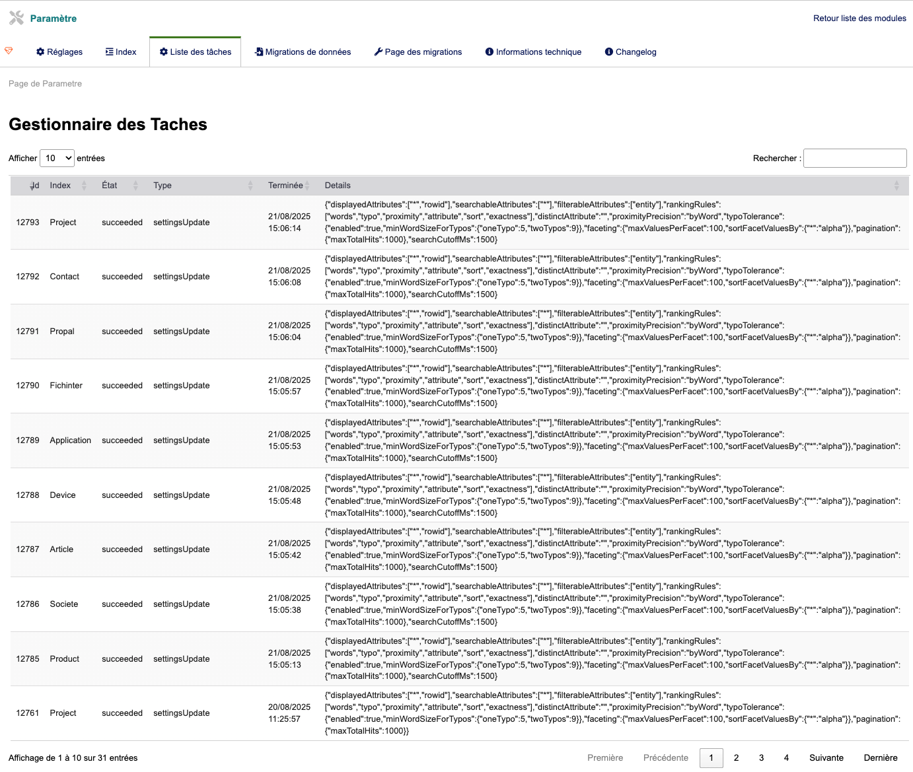
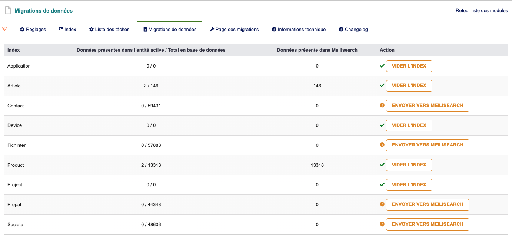
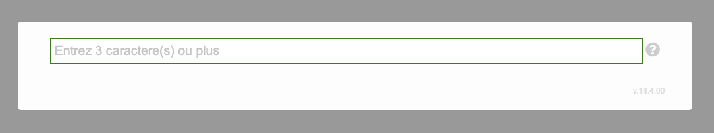
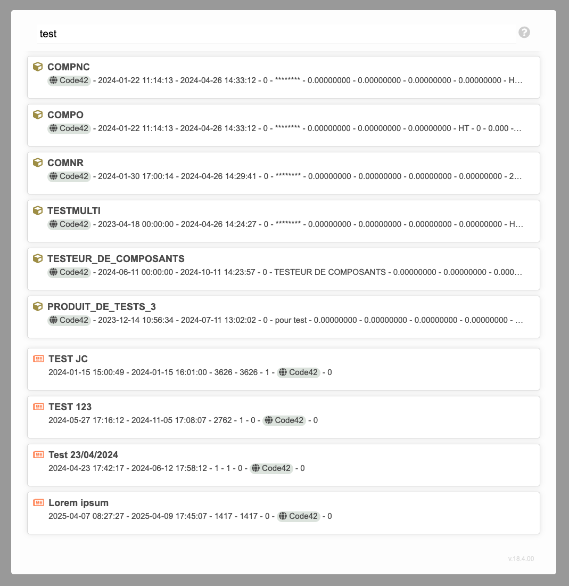
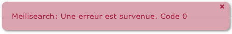

# I. Installation
À l'installation du module et à l'activation, un popup s'affiche si la **clée principale (MasterKey)** et **l'URL** de Meilisearch ne sont pas renseignés ->

Lorsque vous vous rendez dans les paramètres du module : il faut remplir les 2 champs :

*les informations vous sont fournies par l'administrateur du Meilisearch.*

Une fois renseignées, le module se charge de générer les différentes clés dont il a besoin ainsi que les 7 indexes suivants :
- Application
- Article
- Device
- Fichinter
- Product
- Propal
- Société
- Contact
- Projet

Ce qui donnera cet affichage :

L'**ID unique de l'instance** correspond à votre environnement Dolibarr. Cette valeur va permettre d'identifier votre instance sur le serveur, et de générer des indexes spécifiques à votre environnement.

Elle est consultable dans le fichier htdocs/conf/conf.php => $dolibarr_main_instance_unique_id

Toujours sur la page Réglages, il est possible de modifier l'URL ou les différentes clés (Ce qui est déconseillé. Demandez à une personne compétente de le faire si jamais il y a besoin de modifier certaines permissions).

Chaque clé donne accès à différents droits (*seulement sur votre Dolibarr*):
- Clé API Admin -> donne accès à toutes les actions ('*') 
- Clé API de gestion des données : donne accès aux actions CRUD (*Create/Read/Update/Delete*) sur les documents et index
- Clé API: Permet seulement la recherche sur les index (et récupérer leur nom)

# II. Index
La page **Index** nous permet de configurer l'affichage des résultats pour chaque index

Pour chaque index, plusieurs paramètres sont configurables :
- URL : URL de redirection lors d'un clic sur un résultat (Doit toujours commencer par un "/" et se terminer par "?id=")
- Couleur : Couleur utilisée pour l'affichage des résultats de cet index
- Icône : Icône utilisée pour l'affichage de cet index (Seulement les icônes en version 5 de Fontawesome)
- Actions : Ces boutons vous permettent d'enregister ou de réinitialiser les informations propres à un index

Il existe également deux boutons à la fin de chaque élément :
- Le chevron vous permet d'ouvrir les Paramètres d'un index
- La dernière icône vous permet de changer l'ordre d'affichage des index dans les résultats (/!\ N'oubliez pas d'enregister votre index après l'avoir déplacé)

### Paramètres

Les paramètres nous permettent de configurer les champs que l'on désire afficher pour chaque index

Une documentation sur ces paramètres est disponible [ICI](https://www.meilisearch.com/docs/reference/api/settings)

>**IMPORTANT**
>
>Il est obligatoire de garder la valeur "rowid" (ou "*") dans les "searchableAttributes" sous peine de ne pas avoir le lien de redirection.
>
>Veillez également à toujours renseigner "entity" dans le champs "filterableAttributes".

### Erreurs connues

>L'erreur
>
>
>
>est une erreur récurrente -> le champs "searchCutoffMs" est mis à "null" par défaut -> mettre 1500
>
>Il s'agit du temps maximum que va mettre une recherche avant de se couper

Le module est à présent utilisable via l'utilisation du raccourci clavier **option/alt + S**

# III. Listes des tâches

Sur cette page sont affichées les tâches (tâche = création/modification/suppression d'index/de document ou autre)
celles-ci servent de "log".

Une tâche prend de l'espace sur le serveur, il est bien de nettoyer cette section de temps en temps pour éviter la surcharge (si plus de place -> plus d'indexiation ou autre)

Chaque tâche a un statut qui reflète l’état de l’opération en cours :
- **En cours (*enqueued ou processing*)** : La tâche est en train d’être traitée par Meilisearch.
- **Réussie (*succeeded*)** : L’opération s’est terminée avec succès.
- **Échouée (*failed*)** : Un problème est survenu pendant le traitement de la tâche.
- **Annulée (*canceled*)** : L’opération a été annulée avant de se terminer.

# IV. Migrations

Cette page vous permet de gérer la cohérence des données entre votre Dolibarr et votre Meilisearch

A l'installation, toutes les données des différents indexes sont exportées dans Meilisearch.

Il existe 3 types d'action possibles :
- **Vider l'index** : Les données sont synchronisées, mais il est possible de vider l'index Meilisearch pour re-remplir à la main avec les données
- **Envoyer vers Meilisearch** : Supersearch va prendre les données Dolibarr pour les injecter et indexer dans Meilisearch
- **Supprimer dans Meilisearch** : Meilisearch possède plus de données que Dolibarr. Cette action permet donc de supprimer puis ré-importer les donnés dans Meilisearch

Quand une action est en cours il est impossible de l'annuler. Le bouton d'action est alors affiché en tant que "**Tache en cours**", ce qui empêche le spam et/ou la corruption/perte de données

# V. Utilisation
Via le raccourci "opt/alt +s" le popup suivant s'ouvre, il est alors possible de chercher sur tous les indexes :

Résultat avec une recherche :

# VI. CRUD
Le module créera automatiquement un document (entrée) dans Meilisearch lors de la création d'un objet dans Dolibarr, ainsi que pour chaque opération CRUD (Create, Read, Update, Delete)

# VII. Erreurs

Meilisearch a un système de message d'erreur sur certaines de ses actions (*comme par exemple le CRUD*) :

| Code erreur | Signification                           | Résolution                                                                                 |
|------------|-----------------------------------------|--------------------------------------------------------------------------------------------|
| 0          | L'URL Meilisearch n'a pas été renseignée | Se rendre dans la configuration du module et renseigner l'URL                              |
| -1         | Erreur au niveau de la requête (*curl*) | Vérifier la console/les logs Dolibarr pour mieux déterminer cette erreur                   |
| -2         | Erreur inconnue                         | Vérifier la console/les logs Dolibarr pour mieux déterminer cette erreur                   |
| -3         | Permission non accordée                 | Demander à l'administrateur de vérifier les droits qu'ont vos clés                          |
| -3         | Fichier Volumineux                      | Le fichier (*payload*) est trop volumineux, demander à l'administrateur d'agrandir ce cap |

