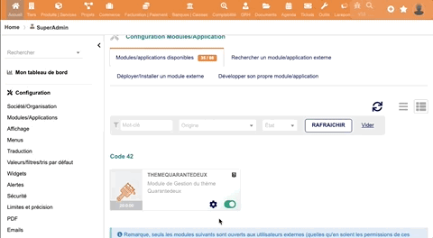
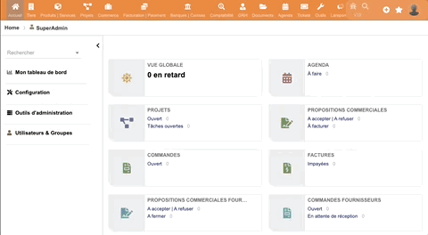

# Documentation Utilisateur

---  

## Menu Classique vs. Menu Moderne

Le thème offre la possibilité de personnaliser le placement du menu selon vos préférences :

📌 **Menu Classique**  – Disposition traditionnelle.  
📌 **Menu Moderne**  – Interface repensée pour une meilleure ergonomie.

### 🔧 Configuration

Deux méthodes permettent d'ajuster ce paramètre :

1. **Globalement (pour tous les utilisateurs)**  
   Rendez-vous dans **"Thème42" → Onglet "Affichage"** via la page de configuration du module.

2. **Individuellement (uniquement pour votre compte utilisateur)**  
   Accédez à **"Interface Utilisateur"** dans votre page de personnalisation.  

🔹 *La configuration globale impacte l'ensemble de Dolibarr, tandis que la configuration individuelle ne concerne que votre session.*